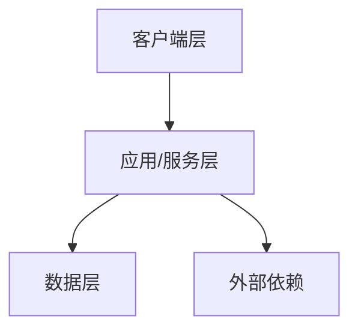

# A02-{项目名}概要设计说明书

> **文档定位**：本文档用于项目验收，描述验收基线对应软件的总体技术设计。内容应来自实际代码、接口、数据库和部署资料，不替代建设阶段的设计与实现权威源。
>
> **使用限制**：本文档仅供用户自行组织的项目验收使用，不计入 PM 交付物或 PM 开发交接包，不得作为程序员设计、开发、联调、构建或实现工作的依据。除用户通过验收专用手动命令直接触发的验收技能外，`评审`、`交付检查` 及任何其他 SKILL 均不得读取、扫描、评审、核查或处理本文档。

<!--
使用说明：
1. 输出文件名为 docs/acceptance/A02-{项目名}概要设计说明书.md。
2. 替换全部占位符并删除本说明块。
3. 架构、组件和部署关系必须能定位到实际资料。
4. 资料不足时标注“⚠️ 待补充”，不得补造技术选型或系统关系。
-->

## 1. 文档信息

| 项目 | 内容 |
| --- | --- |
| 文档名称 | 《A02-{项目名}概要设计说明书》 |
| 所属项目 | {项目名} |
| 文档用途 | 项目验收专用 |
| 文档性质 | 派生设计说明，非建设权威源 |
| 文档版本 | V0.1 |
| 验收批次/基线 | {验收批次或交付基线} |
| 作者 | {作者} |
| 验收确认人 | {验收确认人} |
| 当前状态 | 草稿 / 用户验收中 / 已确认 |
| 创建日期 | {YYYY-MM-DD} |
| 最近更新日期 | {YYYY-MM-DD} |

---

## 2. 版本记录

| 版本 | 日期 | 修改人 | 修改说明 |
| --- | --- | --- | --- |
| V0.1 | {YYYY-MM-DD} | {修改人} | 初始化验收草稿 |

---

## 3. 编写目的与设计范围

### 3.1 编写目的

{说明本文档在项目验收中的用途、目标读者和与 A01/A03 的关系。}

### 3.2 设计范围

- **覆盖范围**：{本批次涉及的系统、模块、服务和基础设施。}
- **不覆盖范围**：{明确排除项及依据。}
- **系统边界**：{本系统与用户、外部系统和第三方服务的边界。}

### 3.3 设计原则与约束

| 编号 | 原则/约束 | 内容 | 来源 |
| --- | --- | --- | --- |
| C-01 | {架构、安全、部署或兼容约束} | {内容} | {实际资料或需求章节} |

---

## 4. 编写依据与资料基线

| 资料名称 | 路径 | 版本/提交标识 | 完整性 | 采用章节 |
| --- | --- | --- | --- | --- |
| {A01、P07、源代码、接口、数据库、部署材料等} | {路径} | {版本} | 完整 / ⚠️ 待补充 | {章节} |

---

## 5. 系统总体架构

### 5.1 系统上下文

{描述用户、系统、外部系统及主要交互关系。}

```mermaid
flowchart LR
    U[用户/角色] --> S[{项目名}]
    S --> E[外部系统或第三方服务]
```

### 5.2 总体架构

{描述实际采用的客户端、服务端、数据层及外部依赖关系。}



### 5.3 技术栈

| 层级 | 技术/产品 | 版本 | 用途 | 证据位置 |
| --- | --- | --- | --- | --- |
| 客户端 / 服务端 / 数据库 / 中间件 | {实际技术} | {版本} | {用途} | {依赖文件、配置或部署材料} |

---

## 6. 模块总体设计

### 6.1 模块划分

| 模块编号 | 模块名称 | 主要职责 | 输入 | 输出 | 依赖模块 | 实现位置 |
| --- | --- | --- | --- | --- | --- | --- |
| M1 | {模块名称} | {职责} | {输入} | {输出} | {依赖或无} | {代码目录/服务} |

### 6.2 模块关系

```mermaid
flowchart LR
    M1[M1-{模块名称}] --> M2[M2-{模块名称}]
```

### 6.3 关键业务流程

| 流程编号 | 流程名称 | 参与模块 | 起点 | 终点 | 异常出口 | 来源 |
| --- | --- | --- | --- | --- | --- | --- |
| F-01 | {流程名称} | {模块} | {起点} | {终点} | {异常出口} | {流程说明/代码} |

---

## 7. 数据架构设计

### 7.1 数据域与数据对象

| 数据域 | 核心对象 | 所属模块 | 主要关系 | 数据来源 |
| --- | --- | --- | --- | --- |
| {数据域} | {对象} | {模块} | {关系摘要} | {模型/建表脚本/数据字典} |

### 7.2 数据存储

| 存储类型 | 产品/实例 | 保存内容 | 访问模块 | 备份与恢复 |
| --- | --- | --- | --- | --- |
| 数据库 / 文件 / 缓存 | {实际产品} | {内容} | {模块} | {实际机制或 ⚠️ 待补充} |

### 7.3 数据流

{描述关键数据的产生、处理、保存和输出路径。}

---

## 8. 接口总体设计

### 8.1 内部接口

| 接口组 | 提供方 | 调用方 | 协议/方式 | 主要用途 | 详细资料 |
| --- | --- | --- | --- | --- | --- |
| {接口组} | {模块/服务} | {模块/服务} | {HTTP/RPC/事件等} | {用途} | {接口文件或 A03 章节} |

### 8.2 外部接口

| 接口编号 | 外部系统 | 方向 | 协议 | 认证方式 | 异常策略 | 来源 |
| --- | --- | --- | --- | --- | --- | --- |
| IF-001 | {系统} | 入站 / 出站 / 双向 | {协议} | {认证} | {重试、超时、降级等} | {实际资料} |

---

## 9. 部署架构设计

### 9.1 部署拓扑


### 9.2 部署单元

| 部署单元 | 数量 | 运行环境 | 部署内容 | 网络要求 | 证据位置 |
| --- | --- | --- | --- | --- | --- |
| {节点或容器} | {数量} | {系统/运行时} | {组件} | {端口/访问关系} | {部署配置} |

### 9.3 配置与环境

| 环境 | 配置类别 | 配置来源 | 敏感信息处理 | 说明 |
| --- | --- | --- | --- | --- |
| 开发 / 测试 / 生产 | {类别} | {配置文件或平台} | {脱敏/密钥管理方式} | {说明} |

---

## 10. 安全总体设计

| 安全域 | 设计措施 | 覆盖模块 | 验证证据 | 来源 |
| --- | --- | --- | --- | --- |
| 认证 / 授权 / 数据 / 传输 / 审计 / 运维 | {实际措施} | {模块} | {测试或配置} | {需求/实现位置} |

---

## 11. 非功能设计

| 类别 | A01 要求 | 总体设计措施 | 验证方式 | 状态 |
| --- | --- | --- | --- | --- |
| 性能 / 稳定性 / 可用性 / 兼容性 / 可维护性 | {A01 编号及要求} | {实际措施} | {测试或监控证据} | 已覆盖 / ⚠️ 待补充 |

---

## 12. 容错、备份与恢复设计

| 场景 | 检测方式 | 处理策略 | 恢复目标 | 验证证据 |
| --- | --- | --- | --- | --- |
| {服务异常、网络异常、数据异常等} | {检测} | {处理} | {RTO/RPO 或实际目标} | {证据} |

---

## 13. 设计追溯矩阵

| A01 需求编号 | 概要设计章节 | 详细设计章节 | 实现位置 | 测试/验收证据 | 状态 |
| --- | --- | --- | --- | --- | --- |
| {A01-REQ 编号} | {本文章节} | {A03 章节或未生成} | {代码/API/数据库位置} | {证据或 ⚠️ 待补充} | 已覆盖 / ⚠️ 待补充 |

---

## 14. 风险、依赖与待补充项

### 14.1 风险与依赖

| 编号 | 类型 | 说明 | 影响 | 应对方式 |
| --- | --- | --- | --- | --- |
| R-01 | 风险 / 依赖 | {说明} | {影响} | {应对方式} |

### 14.2 待补充项

| 编号 | 待补充内容 | 影响章节 | 所需证据 | 责任方 | 状态 |
| --- | --- | --- | --- | --- | --- |
| TBD-01 | {缺失内容；无则删除本行并写“无”} | {章节} | {资料} | {责任方} | ⚠️ 待补充 |

---

## 15. 附录

### 15.1 术语与缩略语

| 术语/缩略语 | 含义 | 来源 |
| --- | --- | --- |
| {术语} | {含义} | {来源} |

### 15.2 参考资料

- {资料名称、路径、版本和章节。}
