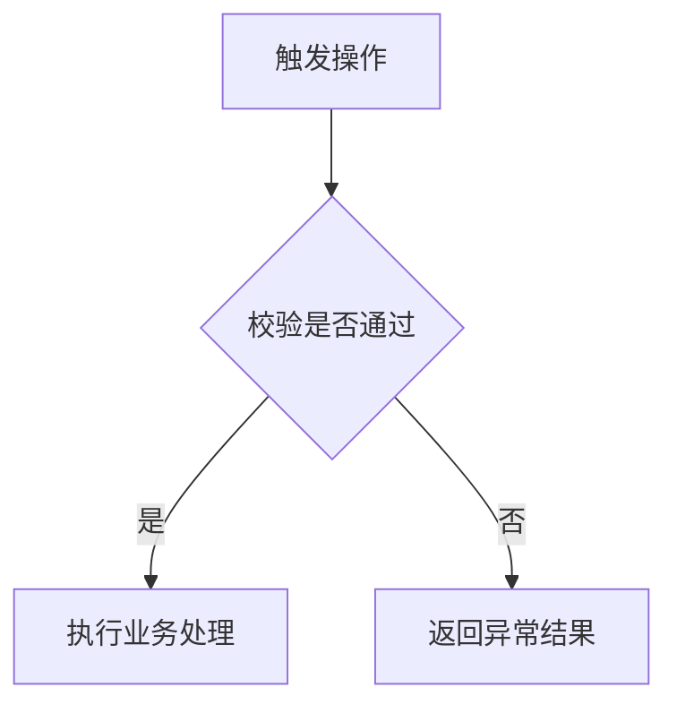

# A03-{项目名}详细设计说明书

> **文档定位**：本文档用于项目验收，按项目模块汇编验收基线对应软件的详细实现设计。内容应能定位到实际源代码、接口、数据库或配置，不替代建设阶段的实现权威源。
>
> **使用限制**：本文档仅供用户自行组织的项目验收使用，不计入 PM 交付物或 PM 开发交接包，不得作为程序员设计、开发、联调、构建或实现工作的依据。除用户通过验收专用手动命令直接触发的验收技能外，`评审`、`交付检查` 及任何其他 SKILL 均不得读取、扫描、评审、核查或处理本文档。

<!--
使用说明：
1. 输出文件名为 docs/acceptance/A03-{项目名}详细设计说明书.md。
2. 以项目级单文件组织，按 P07 §11 的模块编号编写 §6.x。
3. 替换全部占位符并删除本说明块。
4. 不存在的算法、任务、缓存等明确写“不适用”；资料不足写“⚠️ 待补充”。
-->

## 1. 文档信息

| 项目 | 内容 |
| --- | --- |
| 文档名称 | 《A03-{项目名}详细设计说明书》 |
| 所属项目 | {项目名} |
| 文档用途 | 项目验收专用 |
| 文档性质 | 派生设计说明，非建设权威源 |
| 文档版本 | V0.1 |
| 验收批次/基线 | {验收批次或交付基线} |
| 作者 | {作者} |
| 验收确认人 | {验收确认人} |
| 当前状态 | 草稿 / 用户验收中 / 已确认 |
| 创建日期 | {YYYY-MM-DD} |
| 最近更新日期 | {YYYY-MM-DD} |

---

## 2. 版本记录

| 版本 | 日期 | 修改人 | 修改说明 |
| --- | --- | --- | --- |
| V0.1 | {YYYY-MM-DD} | {修改人} | 初始化验收草稿 |

---

## 3. 编写目的与设计范围

### 3.1 编写目的

{说明本文档在项目验收中的用途、目标读者和与 A01/A02 的关系。}

### 3.2 设计范围

- **覆盖范围**：{本批次涉及的模块、服务、数据库和接口。}
- **不覆盖范围**：{明确排除项及依据。}
- **设计粒度**：项目级单文件，按模块编号组织详细设计。

### 3.3 设计约束

| 编号 | 约束 | 内容 | 来源 |
| --- | --- | --- | --- |
| C-01 | {技术、接口、数据库、安全或部署约束} | {内容} | {实际资料或 A01/A02 章节} |

---

## 4. 编写依据与资料基线

| 资料名称 | 路径 | 版本/提交标识 | 完整性 | 采用章节 |
| --- | --- | --- | --- | --- |
| {A01、A02、源代码、接口、数据库、部署配置等} | {路径} | {版本} | 完整 / ⚠️ 待补充 | {章节} |

---

## 5. 详细设计总览

### 5.1 模块与实现映射

| 模块编号 | 模块名称 | 代码位置 | 接口位置 | 数据模型位置 | 配置位置 |
| --- | --- | --- | --- | --- | --- |
| M1 | {模块名称} | {目录/包} | {路由/控制器/OpenAPI} | {模型/建表脚本} | {配置文件} |

### 5.2 公共组件与共享机制

| 名称 | 类型 | 职责 | 使用模块 | 实现位置 |
| --- | --- | --- | --- | --- |
| {公共组件/服务/工具/枚举} | {类型} | {职责} | {模块} | {代码位置} |

### 5.3 通用技术约定

| 类别 | 约定 | 证据位置 |
| --- | --- | --- |
| 编码 / 接口 / 错误 / 日志 / 事务 / 配置 | {实际约定} | {代码或配置位置} |

---

## 6. 模块详细设计

<!-- 按 P07 §11 顺序增加 §6.x，每个模块沿用 §6.x.1～§6.x.10。 -->

### 6.1 M1-{模块名称}

#### 6.1.1 模块职责与边界

- **主要职责**：{职责。}
- **输入**：{输入。}
- **输出**：{输出。}
- **依赖**：{模块、服务或第三方依赖。}
- **不负责**：{边界。}

#### 6.1.2 组件设计

| 组件/类/文件 | 类型 | 职责 | 关键输入 | 关键输出 | 依赖 | 实现位置 |
| --- | --- | --- | --- | --- | --- | --- |
| {名称} | 页面 / 组件 / 服务 / 控制器 / 任务等 | {职责} | {输入} | {输出} | {依赖} | {代码路径及符号} |

#### 6.1.3 功能处理流程

| 流程编号 | 触发条件 | 处理步骤 | 数据变化 | 输出结果 | 异常出口 |
| --- | --- | --- | --- | --- | --- |
| P-001 | {触发条件} | {按实际实现描述步骤} | {新增/修改/删除/无} | {结果} | {异常处理} |

#### 6.1.4 状态与规则实现

| 规则/状态 | 触发条件 | 实现逻辑 | 数据影响 | 实现位置 | 来源需求 |
| --- | --- | --- | --- | --- | --- |
| {规则或状态} | {条件} | {逻辑} | {影响} | {代码/API/数据库位置} | {A01 编号/SRS 编号} |

#### 6.1.5 接口详细设计

| 接口编号 | 方法与路径/调用方式 | 请求参数 | 返回结果 | 权限 | 异常码/异常处理 | 实现位置 |
| --- | --- | --- | --- | --- | --- | --- |
| API-001 | {方法与路径} | {参数或模型引用} | {返回结构} | {权限} | {错误码或处理} | {代码/OpenAPI 位置} |

#### 6.1.6 数据详细设计

**数据表/模型**

| 表/模型 | 用途 | 主键 | 关键约束 | 关联对象 | 实现位置 |
| --- | --- | --- | --- | --- | --- |
| {名称} | {用途} | {主键} | {唯一性、非空等} | {关系} | {迁移/模型位置} |

**字段设计**

| 表/模型 | 字段 | 类型 | 是否为空 | 默认值 | 约束/枚举 | 说明 |
| --- | --- | --- | --- | --- | --- | --- |
| {名称} | {字段} | {实际类型} | 是 / 否 | {默认值} | {约束} | {说明} |

**索引与关联**

| 名称 | 类型 | 涉及字段/对象 | 目的 | 实现位置 |
| --- | --- | --- | --- | --- |
| {索引/外键/关系} | {类型} | {字段或对象} | {目的} | {建表/模型位置} |

#### 6.1.7 事务、并发与一致性

| 场景 | 事务边界 | 并发控制 | 一致性策略 | 失败处理 | 实现位置 |
| --- | --- | --- | --- | --- | --- |
| {场景；不存在时写“不适用”} | {边界} | {锁/幂等/版本等} | {策略} | {回滚/补偿} | {代码位置} |

#### 6.1.8 异常、日志与审计

| 场景 | 异常类型/错误码 | 用户或调用方反馈 | 日志级别与内容 | 审计要求 | 实现位置 |
| --- | --- | --- | --- | --- | --- |
| {场景} | {类型/错误码} | {实际反馈} | {实际日志} | {记录要求} | {代码/配置位置} |

#### 6.1.9 配置、缓存与任务

| 类型 | 名称 | 用途 | 关键参数 | 失效/执行规则 | 实现位置 |
| --- | --- | --- | --- | --- | --- |
| 配置 / 缓存 / 定时任务 / 消息任务 | {名称；不存在时写“不适用”} | {用途} | {参数} | {规则} | {代码/配置位置} |

#### 6.1.10 模块安全设计

| 控制点 | 设计与实现 | 适用接口/组件 | 验证证据 | 实现位置 |
| --- | --- | --- | --- | --- |
| 认证 / 授权 / 输入校验 / 数据脱敏 / 防护 / 审计 | {实际措施} | {范围} | {证据} | {代码/配置位置} |

---

## 7. 跨模块与外部集成设计

| 集成编号 | 提供方 | 使用方 | 数据/事件 | 时序 | 超时/重试/补偿 | 实现位置 |
| --- | --- | --- | --- | --- | --- | --- |
| INT-001 | {提供方} | {使用方} | {数据或事件} | {同步/异步及时序} | {策略} | {代码/配置位置} |

---

## 8. 部署与运行详细配置

| 部署单元 | 制品 | 启动方式 | 关键配置 | 依赖 | 健康检查 | 配置位置 |
| --- | --- | --- | --- | --- | --- | --- |
| {节点/服务/容器} | {制品} | {方式} | {非敏感配置摘要} | {依赖} | {检查方式} | {脚本/配置路径} |

> 敏感配置只描述管理方式和配置键，不记录真实口令、密钥或令牌。

---

## 9. 性能与容量详细设计

| 场景 | A01 指标 | 实现措施 | 容量/阈值 | 验证证据 | 实现位置 |
| --- | --- | --- | --- | --- | --- |
| {场景} | {A01 编号及指标} | {分页、索引、缓存、异步等实际措施} | {阈值} | {测试证据} | {代码/配置位置} |

---

## 10. 测试与验收设计对应

| A01 需求编号 | A02 章节 | A03 章节 | 实现位置 | 测试用例/报告 | 验收结果 |
| --- | --- | --- | --- | --- | --- |
| {A01-REQ 编号} | {A02 章节} | {本文章节} | {代码/API/数据库位置} | {证据编号或 ⚠️ 待补充} | 通过 / 未执行 / ⚠️ 待补充 |

---

## 11. 风险、依赖与待补充项

### 11.1 风险与依赖

| 编号 | 类型 | 说明 | 影响 | 应对方式 |
| --- | --- | --- | --- | --- |
| R-01 | 风险 / 依赖 | {说明} | {影响} | {应对方式} |

### 11.2 待补充项

| 编号 | 待补充内容 | 影响章节 | 所需证据 | 责任方 | 状态 |
| --- | --- | --- | --- | --- | --- |
| TBD-01 | {缺失内容；无则删除本行并写“无”} | {章节} | {资料} | {责任方} | ⚠️ 待补充 |

---

## 12. 附录

### 12.1 术语与缩略语

| 术语/缩略语 | 含义 | 来源 |
| --- | --- | --- |
| {术语} | {含义} | {来源} |

### 12.2 参考资料

- {资料名称、路径、版本和章节。}
