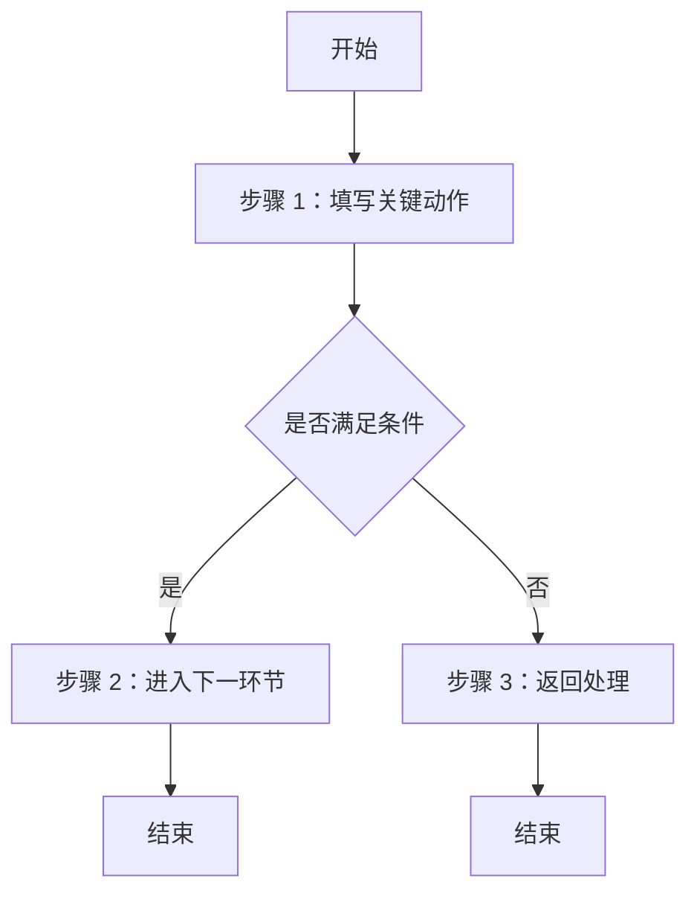

# 业务流程说明模板

## 1. 文档信息

| 项目 | 内容 |
| --- | --- |
| 流程名称 |  |
| 所属项目/版本 |  |
| 作者 |  |
| 评审人 |  |
| 创建日期 |  |

## 2. 流程目标

- 流程适用场景：
- 触发条件：
- 参与角色：
- 输出结果：

## 3. 关键业务规则

- 规则 1：
- 规则 2：

## 4. 前置条件

- 

## 5. 流程说明

| 步骤 | 执行角色 | 操作说明 | 输出/结果 |
| --- | --- | --- | --- |
| 1 |  |  |  |

## 6. Mermaid 流程图

## 7. 异常与边界

- 异常场景 1：
- 异常场景 2：
- 边界条件：

## 8. 风险与控制点

| 风险点 | 影响 | 控制方式 |
| --- | --- | --- |
|  |  |  |

## 9. 关联输出物

- 对应 PRD：
- 对应 SRS：
- 对应原型：
- 对应测试用例：
