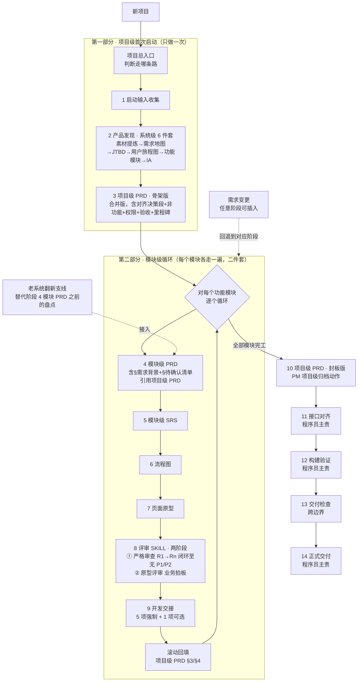

# 项目全流程操作手册

> 本手册供 PM 在项目工作中打印、随手翻阅，描述从项目启动到模块开发交接、项目级封板，以及程序员续接阶段的完整操作路径。

## 文档信息

| 项目 | 内容 |
| --- | --- |
| 文档名称 | 《项目全流程操作手册》 |
| 文档版本 | V2.0 |
| 适用对象 | 产品经理、业务评审人；程序员可查阅续接章节 |
| 适用范围 | 新项目、新模块、需求变更、评审、开发交接和项目级封板 |
| 流程基线 | P07 合并版 + 模块 PRD/SRS 二件套 + `评审` 两阶段 + 5 项强制/1 项可选开发交接 |
| 最近更新日期 | 2026-07-15 |
| 当前状态 | 现行版 |

## 修订记录

| 版本 | 日期 | 修改说明 |
| --- | --- | --- |
| V2.0 | 2026-07-15 | 面向打印查阅重组导航；统一阶段卡片字段；澄清模块交接与项目封板边界；补充文档治理速查 |
| V1.x | 2026-06-18 | 合并评审 SKILL、采用 P07 合并版与模块二件套、加入待回写和会话管理机制 |

## 使用方式与权威边界

- **按任务查阅**：先看下方“快速查阅索引”，直接翻到当前任务，不要求从头通读。
- **按阶段执行**：阶段卡片回答何时进入、谁负责、需要什么、产出什么、何时停止。
- **按清单复核**：项目推进时使用第八部分的一页速查清单逐项勾选。
- **权威边界**：本手册负责导航和解释；实际执行约束以对应 SKILL、`.cursor/rules/` 和正式模板为准。发生冲突时，先按权威文件处理，再更新本手册。

## 快速查阅索引

| 当前任务 | 直接查阅 |
| --- | --- |
| 第一次启动新项目 | 第一部分：阶段 0～3 |
| 新增一个功能模块 | 第二部分：阶段 4～9 |
| 老系统模块翻新 | 第四部分：横切 C → 第二部分阶段 4 |
| 客户提出需求变更 | 第四部分：横切 A |
| 单独生成、补充或升版文档 | 第四部分：横切 B |
| 严格审查 / 原型评审 | 第二部分：阶段 8A / 8B |
| 向开发团队交接模块 | 第二部分：阶段 9 |
| 全部模块完成后封板 P07 | 第三部分：阶段 10 |
| 接口、构建和正式交付 | 第三部分：阶段 11～14 |
| 查待回写、会话和 Token 节省 | 第五部分 |
| 查命名、权威源和文档自检 | 第六部分 |
| 查归档目录 | 第七部分 |
| 打印后逐项勾选 | 第八部分 |

> **当前审查结论（2026-07-15）**：PM 主流程、文档治理与开发交接口径已对齐现行规则；质量门、死引用检查、Git 和 Node 版本声明为已接受的工程治理风险，不作为 PM 交付门槛。
>
> 阅读约定：
>
> - 🛑 = 强制检查点（该步做完必须停下等你确认，AI 不会自动往下冲）。
> - ⚠️ = 需业务方确认 / 待确认事项。
> - 💡 = 节省 AI 消耗的小贴士（散落各阶段，集中归纳见第五部分）。
> - 「项目级一次性」= 整个项目只做一次；「模块级循环」= 每个功能模块各做一遍。

---


## 一、整体心智模型（先记住这 3 个角色）


| SKILL       | 比喻        | 作用                               | 频次                |
| ----------- | --------- | -------------------------------- | ----------------- |
| **项目总入口**   | 分诊台       | 判断你该走哪条流程，只分流不产出                 | 拿不准时随时喊           |
| **项目与模块启动** | 总包工头      | 带你从需求一路做到原型（含翻新场景子分支）            | 项目级 1 次 + 每模块 1 次 |
| **产品发现**    | 开工前的勘探设计院 | 把模糊素材勘探成系统级总规划（地图/JTBD/旅程/功能/IA） | **整个项目仅 1 次**     |


一句话：**迷路找总入口；要从需求做到原型找项目与模块启动；项目最开头那一次性的总体规划由产品发现完成。**

### 1.1 全部 PM 可用 SKILL（共 6 个 PM 主责 + 3 个边界 SKILL）


| 主责方  | SKILL       | 简述                                      |
| ---- | ----------- | --------------------------------------- |
| PM   | `项目与模块启动`   | 带你做需求 → 原型；含翻新场景子分支                     |
| PM   | `产品发现`      | 项目级一次性，系统级 6 件套                         |
| PM   | `评审`        | 两阶段强制：阶段 1 严格审查（技术 QA）→ 阶段 2 原型评审（业务拍板） |
| PM   | `需求变更`      | 任意阶段的变更结构化处理                            |
| PM   | `开发交接`      | 原型评审通过后产出数据字典等开发包                       |
| PM   | `文档生成与版本管理` | 单独生成 / 补充 / 升版任意文档                      |
| 跨边界  | `交付检查`      | 广度一致性核验，评审前 / 交付前均可触发                   |
| 程序员  | `接口对齐`      | mock 字段 vs 真实接口对照                       |
| 基础设施 | `启动项目`      | 启动 Vite 开发服务器                           |


---


## 二、全流程总览图




> 打印友好的文字版流程：
>
> **项目级开头（1 次）**：总入口 → ①启动输入 → ②产品发现(6 件套) → ③项目级 PRD 骨架版（合并版）
> **模块级循环（每模块各一遍）**：④模块 PRD（含需求背景）→ ⑤模块 SRS → ⑥流程图 → ⑦原型 → ⑧评审两阶段 → ⑨开发交接 → 回填项目级 PRD §3/§4
> **项目级封板（PM 归档动作，1 次）**：⑩项目级 PRD 封板版
> **程序员续接**：⑪接口对齐 → ⑫构建验证 → ⑬交付检查（跨边界）→ ⑭正式交付

---


## 三、PM 与程序员责任边界（重要）

- **模块级 PM 交付终点**：每个模块完成【⑨开发交接】即完成该模块的 PM 交付；交付前确认 `npm run dev` 可启动、关键原型流程可演示。
- **项目级 PM 归档动作**：全部模块完成后执行【⑩项目级 P07 封板】，补齐模块索引与依赖矩阵。该动作不反向阻断或撤销已完成的模块开发交接。
- **程序员主责**：【⑪接口对齐】及之后的生产构建、数据库、接口联调和部署；`npm run build` 不作为 PM 原型交付门槛。
- **跨边界**：【⑬交付检查】可在 PM 评审前作为一致性自检，也可在程序员正式交付前执行。

| 边界类型 | PM 翻阅时的判断口径 |
| --- | --- |
| **PM 必须完成** | 项目级阶段 0～3；每个模块阶段 4～9；全部模块完成后的阶段 10 |
| **PM 按需完成** | 独立流程说明、测试用例、用户手册及其他按业务需要增加的交付物 |
| **程序员接手完成** | 阶段 11 接口对齐、阶段 12 构建验证、阶段 14 正式交付 |
| **跨边界共同检查** | 阶段 13 交付检查；接口字段和枚举语义需要 PM 时按需协助 |

---


# 第一部分 · 项目级首次启动（整个项目只做一次）


## 阶段 0：项目总入口（分流）


| 项 | 内容 |
| --- | --- |
| **何时进入** | 不确定下一步该做什么，或无法判断应触发哪个 SKILL 时 |
| **主责方** | PM 发起，AI 负责分流 |
| **承载 SKILL** | `项目总入口` |
| **输入** | 一句话诉求 + 现有材料情况 |
| **核心动作** | 判断任务类型，分流到正确的 SKILL；目标不清晰时先追问 |
| **输出** | “该走哪条路线”的判断，不产出正式文档 |
| **归档** | 无 |
| **检查点** | 🛑 PM 确认分流方向后再进入对应流程 |
| **下一步** | 全新项目进入阶段 1；其他任务按分流结果跳转 |


---


## 阶段 1：启动输入收集


| 项 | 内容 |
| --- | --- |
| **何时进入** | 项目总入口确认本次为全新项目后 |
| **主责方** | PM |
| **承载 SKILL** | `项目与模块启动`（项目级） |
| **输入** | 口头描述、Word 草稿、调研对话、会议记录、领导讲话、产品定位等原始材料 |
| **核心动作** | 收集项目背景、目标、角色、范围和已有材料；确认本轮目标停止节点 |
| **输出** | 整理后的启动输入，作为产品发现的直接输入 |
| **归档** | 无独立文档；原始材料按需放入 `docs/user-requirements/` |
| **检查点** | 🛑 PM 确认启动输入完整后停止 |
| **下一步** | 阶段 2 产品发现 |


💡 **节省消耗**：如果材料超过 50 页 / 10 万字，**先在文件系统里整理好分类**（按"调研访谈 / 领导讲话 / 现有原型截图"分目录），再让 AI 按需读取，避免一次性 dump 全部入对话。

---


## 阶段 2：产品发现（系统级 6 件套 · 项目级一次性）

> 这是把"模糊、分散、大量"的原始素材，收敛成可落地系统级结构的核心阶段。由 `产品发现` SKILL 承载，**整个项目只做一次**，之后每个模块都引用它的成果，不重做。

| 项 | 内容 |
| --- | --- |
| **何时进入** | 阶段 1 启动输入已确认后 |
| **主责方** | PM |
| **承载 SKILL** | `产品发现` |
| **输入** | 已确认的启动输入和原始需求材料 |
| **核心动作** | 先确认重/中/轻档，再按档位完成素材提炼、需求结构、功能模块和信息架构 |
| **输出** | P01～P06 中当前档位要求的系统级产品发现成果 |
| **归档** | `docs/discovery/` |
| **检查点** | 🛑 每个子阶段完成后停止确认 |
| **下一步** | 阶段 3 项目级 P07 骨架版 |

**档位先选（强制，省钱关键）**：进入素材提炼前，AI 会先和你完成档位确认。


| 档位           | 适用场景                      | 做哪些子阶段                                                                          | 大致 Token 消耗 |
| ------------ | ------------------------- | ------------------------------------------------------------------------------- | ----------- |
| **重档**       | 复杂面向用户 / 多角色 / 多触点 / 流程长  | 6 子阶段全做（P01~P06 全产出）                                                            | 高           |
| **中档**（默认推荐） | 中等复杂度的内部系统 / 单 B 端 / 流程清晰 | P01 素材提炼 + P05 功能模块 + P06 IA 必做；P02 需求地图并入 P05、P03 JTBD 简化为对照表（仍产出）、P04 用户旅程图跳过 | 中           |
| **轻档**       | 工具型 / 极简内部页               | 3 子阶段（仅 P01 素材提炼 + P05 功能模块 + P06 IA；P02/P03/P04 全跳过）                           | 低           |


💡 **节省消耗**：默认选**中档**，等模块原型评审时如发现痛点没识别再补做 JTBD/旅程。**禁止默认选重档**——绝大多数中后台系统中档够用，重档会多消耗 30-50% token。

**全链路可追溯**：每层条目带来源 ID，形成 `M-（素材）→ RM-（需求地图）→ JTBD- → UJ-（旅程触点）→ F-（功能）→ IA-` 的链路。


| 子阶段          | 做什么                                                                    | 输入           | 输出产物（系统级各一份）                                   |
| ------------ | ---------------------------------------------------------------------- | ------------ | ---------------------------------------------- |
| 0 素材提炼与价值取舍  | 按价值评分裁决去留、噪声留痕不删（重档 5 维评分 + ✅纳入/🟡降级/⚠️拆解/❌丢弃；中/轻档 3 档评分 ✅/🟡/❌，无⚠️拆解） | 阶段 1 的全部原始素材 | 《P01-{系统名}素材提炼与价值取舍》                           |
| 1 需求地图       | 把纳入的需求按多级主题铺成全景                                                        | 素材提炼产物       | 《P02-{系统名}需求地图》（仅重档独立产出；中档并入 P05、轻档跳过）         |
| 2 JTBD（用户任务） | 收敛出用户核心任务与动机                                                           | 需求地图         | 《P03-{系统名}JTBD（用户任务）分析》（中档简化为角色-任务对照表仍产出；轻档跳过） |
| 3 用户旅程图      | 画用户达成目标的阶段/触点/痛点，痛点驱动功能发现                                              | JTBD + 角色    | 《P04-{系统名}用户旅程图》（中/轻档跳过）                       |
| 4 功能模块清单     | 聚类出多级功能模块（= 后续模块拆分依据）                                                  | 旅程 + JTBD    | 《P05-{系统名}功能模块清单》                              |
| 5 信息架构 IA    | 组织成系统导航/页面层级，作为原型输入                                                    | 功能模块清单       | 《P06-{系统名}信息架构（IA）》                            |

---


## 阶段 3：项目级 PRD · 骨架版（合并版 · 系统级 · 一次性定锚）

> **本阶段为合并版**：原"项目对齐稿 + 项目级 PRD"已并为单一文件 `P07-{系统名}产品需求文档（PRD）.md`，不再产出独立的项目对齐稿。


| 项 | 内容 |
| --- | --- |
| **何时进入** | 产品发现成果达到当前档位完成标准后 |
| **主责方** | PM |
| **承载 SKILL** | `项目与模块启动`（项目级） |
| **输入** | 产品发现成果 + PM 口头确认 |
| **核心动作** | 先填 §9～§12 对齐决策段，再补 §1、§2、§5～§8 项目级骨架；§3、§4 留壳待回填 |
| **输出** | 《P07-{系统名}产品需求文档（PRD）》骨架版，内文标题含“· 项目级” |
| **归档** | `docs/formal-requirements/P07-{系统名}产品需求文档（PRD）.md` |
| **检查点** | 🛑 §9 决策逐项确认，且 §1、§2、§5～§8 各成节后停止 |
| **下一步** | 进入第二部分，按模块循环执行阶段 4～9 |

> **关键约束**：不得展开模块业务功能；不得复制产品发现已有内容，只做具体章节引用。

💡 **节省消耗**：本阶段最费时、也最占上下文的是 §9 已确认决策表（常见为三十至五十条）。建议拆成**两次会话**完成：第一次只写「对齐决策段」（§9 至 §12），并与你逐条对齐；第二次再补 §1、§2 以及 §5 至 §8 的项目级锚点章节。这样避免同一会话里既要读完产品发现六件套，又要带着整份决策表反复修改，双重上下文叠加，token 消耗会明显偏高。

> 至此项目级首次启动完成。下面对**每个功能模块**逐个循环。

---


# 第二部分 · 模块级循环（每个功能模块各走一遍 · 二件套）

> 模块从产品发现的《功能模块清单》拆出。每个模块独立走下面阶段 4～阶段 9。模块级**不重做产品发现**，直接引用项目级成果（含项目级 PRD）。
>
> **模块级二件套（强制）**：新模块默认只产出 **PRD + SRS** 两份文档，**不再单独写结构化需求底稿（M{n}-01）**。原底稿的"需求背景 / 角色权限概述 / 待确认清单"职责整体下沉到模块级 PRD 的 §需求背景 + §待确认清单。


## 阶段 4：模块级 PRD（二件套首件）


| 项 | 内容 |
| --- | --- |
| **何时进入** | P07 已定锚，并从 P05 / P07 §11 选定当前模块后 |
| **主责方** | PM |
| **承载 SKILL** | `项目与模块启动`（或 `文档生成与版本管理`） |
| **输入** | 项目级 P07 §9～§12 + 产品发现中当前模块的相关条目 |
| **核心动作** | 完成需求背景、范围、角色、业务流程、业务规则、业务级验收和待确认清单 |
| **输出** | 《M{n}-02-{模块名}模块产品需求文档（PRD）》，内文标题含“· 模块级” |
| **归档** | `docs/formal-requirements/` |
| **检查点** | 🛑 PM 确认模块业务范围、角色、规则和待确认清单 |
| **下一步** | 阶段 5 模块级 SRS |

> **关键约束**：PRD 写业务视角，不展开字段类型和校验；引用 P07 项目级非功能、权限和术语，不重复定义。

> ⚠️ **老系统翻新支线**：若该模块在老系统已有实现，**本阶段之前先走 §横切 C 老系统翻新支线**，产出《M{n}-01-{模块名}模块老系统盘点与翻新决策》作为本 PRD 的输入；PM 确认翻新决策后再回到本阶段。

💡 **节省消耗**：模块 PRD 章节固定，**复用模板** `templates/requirements/module-prd-template.md` 让 AI 按模板填充比开放式生成省 20-30% token。

---


## 阶段 5：模块级 SRS（二件套次件）


| 项 | 内容 |
| --- | --- |
| **何时进入** | 模块 PRD 的业务范围和规则已确认后 |
| **主责方** | PM |
| **承载 SKILL** | `项目与模块启动`（或 `文档生成与版本管理`） |
| **输入** | 已确认的模块级 PRD |
| **核心动作** | 定义字段、控件、校验、权限、接口数据、状态规则、异常处理和技术 AC；§5 每功能点采用五段式 |
| **输出** | 《M{n}-03-{模块名}模块软件需求规格说明书（SRS）》 |
| **归档** | `docs/formal-requirements/` |
| **检查点** | 🛑 锁定字段名、状态名、规则和技术 AC，后续原型不得擅自改变 |
| **下一步** | 复杂流程进入阶段 6；简单流程可在 SRS 内表达后直接进入阶段 7 |


---


## 阶段 6：流程图


| 项 | 内容 |
| --- | --- |
| **何时进入** | SRS 已确认，且流程包含较多节点或异常分支时 |
| **主责方** | PM |
| **承载 SKILL** | `项目与模块启动`（或 `文档生成与版本管理`） |
| **输入** | 模块 PRD、SRS |
| **核心动作** | 用 Mermaid 和文字说明主流程、异常流程、角色、状态与边界 |
| **输出** | 《M{n}-04-{模块名}模块流程说明》；简单流程可直接写入 SRS §5.x.3 |
| **归档** | `docs/flow/`（按需创建） |
| **检查点** | 🛑 流程节点、判断条件、异常分支与 PRD/SRS 一致 |
| **下一步** | 阶段 7 页面原型 |


> 💡 **可省略场景**：模块流程简单（< 5 个节点 + 无异常分支）时，可直接在 SRS §5.x.3 处理逻辑里画 mermaid，不单独成文件。

---


## 阶段 7：页面原型


| 项 | 内容 |
| --- | --- |
| **何时进入** | SRS 字段、状态和交互规则已锁定后 |
| **主责方** | PM |
| **承载 SKILL** | `项目与模块启动` |
| **输入** | SRS 功能规格、字段、状态机；IA 页面结构；流程说明（如有） |
| **核心动作** | 搭建可评审的 Vue 原型，覆盖正常、空、异常和禁用状态 |
| **输出** | 页面组件、Mock、路由/菜单等实际依赖 + 页面清单 |
| **归档** | `src/views/{模块目录}/`、`src/mock/` 及实际依赖位置 |
| **检查点** | 🛑 原型可演示，且字段、状态、交互与 SRS 一致 |
| **下一步** | 阶段 8A 严格审查 |


> 💡 **小改时的回写策略**：原型搭好后你会频繁微调（改文案 / 调颜色 / 合并字段等），**这些小改 AI 默认不立刻同步到 PRD/SRS**，而是记入 `docs/_待回写清单.md`，等阶段 8 评审窗口或后续 `/交付检查` / `/需求变更` 等窗口统一回写。详见第五部分 §5.1。

---


## 阶段 8：评审（两阶段强制顺序）

> **本阶段为合并版**：原"严格审查 + 原型评审"已统一为 `评审` SKILL 两阶段，**强制先做阶段 1（技术 QA），闭环至无 P1/P2 后才能做阶段 2（业务拍板）**，不可并行 / 跳过 / 换序。


### 8A：阶段 1 · 严格审查（技术 QA · 多轮）


| 项 | 内容 |
| --- | --- |
| **何时进入** | 原型达到可评审状态后 |
| **主责方** | AI 技术 QA，PM 决定修复方向 |
| **承载 SKILL** | `评审` 阶段 1（`/严格审查` 或 `/评审` 默认入口） |
| **输入** | PRD、SRS、原型、Mock、规则基准和 `docs/_待回写清单.md` |
| **核心动作** | 先批量回写清单，再扫描 PRD→SRS 业务覆盖、SRS↔Vue 技术规格和实现质量 |
| **输出** | 《{模块名}严格审查报告-R{轮次}-{YYYYMMDD}》 |
| **归档** | `docs/review/` |
| **检查点** | 🛑 多轮 R1→Rn 闭环至无 P1/P2；问题状态回写为 ✅、🟡 或 ❌ |
| **下一步** | 无 P1/P2 后进入阶段 8B；否则按 PM 决策修复并复核 |


### 8B：阶段 2 · 原型评审（业务拍板）


| 项 | 内容 |
| --- | --- |
| **何时进入** | 阶段 8A 已闭环至无 P1/P2 后 |
| **主责方** | PM / 业务方 |
| **承载 SKILL** | `评审` 阶段 2（`/原型评审`） |
| **输入** | 原型、PRD、SRS、流程说明（如有）和最近一轮严格审查报告 |
| **核心动作** | 从业务视角判断覆盖情况，记录通过项、需修改项、待确认项和阶段决策 |
| **输出** | 《{模块名}原型评审结论》或项目级阶段决策报告 |
| **归档** | `docs/review/` |
| **检查点** | 🛑 PM / 业务方填写 §5.1 决策表，AI 再同步 §5.2、§6、§8 |
| **下一步** | 通过且决定继续时进入阶段 9；否则按决策修订或停止 |


💡 **节省消耗**：阶段 1 多轮迭代时，**强烈建议每一轮开新会话**（详见第五部分 §5.2）。同会话里跑完 R1→R3 三轮会让 AI 反复读取整份历史，token 消耗呈平方级增长；每轮新会话只需读"当前轮 + 上一轮报告"，单轮成本下降 60-70%。

---


## 阶段 9：开发交接（模块级 PM 交付终点）


| 项 | 内容 |
| --- | --- |
| **何时进入** | 阶段 8B 原型评审通过，且 PM / 业务方决定继续交接后 |
| **主责方** | PM |
| **承载 SKILL** | `开发交接` |
| **输入** | 模块 PRD、SRS §5、原型代码包、原型评审结论；流程说明（如有） |
| **核心动作** | 生成数据字典，校验并组织 5 项强制交付物；存在流程图时作为 1 项可选内容纳入 |
| **输出** | 5 项强制：PRD、SRS、数据字典、原型代码包、原型评审结论；1 项可选：流程说明 |
| **归档** | 数据字典进入 `docs/data/`；其余交付物保留原归档位置 |
| **检查点** | 🛑 完成后选择：进入程序员接口对齐 / 当前模块收尾 / 生成按需增项 |
| **下一步** | 回填 P07 §3/§4；继续下一模块，或全部模块完成后进入阶段 10 |

> **模块级 PM 交付完成标准**：原型评审通过；`npm run dev` 可启动；关键页面可演示；5 项强制齐全；代码包列明实际依赖。无需先执行 `npm run build`。

> 至此该模块的 PM 原型交付完成。生产构建、接口联调、数据库和部署由程序员接手，不反向阻断 PM 交付结论。返回循环起点处理下一个模块；全部模块完工后进入阶段 10 项目级 PRD 封板版。

---


# 第三部分 · 项目级封板与程序员续接


## 阶段 10：项目级 PRD · 封板版（系统级 · 项目收尾前一次性封板）

> 全部模块循环完工后，对项目级 PRD 做最后一次复核与封板，作为正式交付的需求权威源。


| 项 | 内容 |
| --- | --- |
| **何时进入** | 全部模块均完成阶段 9，并已滚动回填 P07 §3/§4 后 |
| **主责方** | PM |
| **承载 SKILL** | `项目与模块启动`（项目级） |
| **输入** | 阶段 3 骨架版、各模块回填记录和全部模块 PRD |
| **核心动作** | 补全 §3 模块索引和 §4 依赖矩阵；复核 §1、§5～§9；按版本规则封板 |
| **输出** | 《P07-{系统名}产品需求文档（PRD）》封板版，覆盖原骨架版同一文件 |
| **归档** | `docs/formal-requirements/P07-{系统名}产品需求文档（PRD）.md` |
| **检查点** | 🛑 §3 与实际模块 PRD 一一对应，§4 无遗漏且无依赖时显式写“无” |
| **下一步** | 完成 PM 项目级归档；程序员按需进入阶段 11 |

> 阶段 10 不反向阻断或撤销已完成的模块开发交接；它解决的是项目级 P07 最终完整性。


---

> **程序员续接说明**：以下阶段 11～14 不属于 PM 模块原型交付门槛。PM 仅在接口字段确认和交付检查中按需协助。


## 阶段 11：接口对齐（程序员主责，PM 协助）


| 项 | 内容 |
| --- | --- |
| **何时进入** | 模块开发交接完成，且真实后端契约已具备或联调准备开始时 |
| **主责方** | 程序员，PM 协助确认业务字段和枚举语义 |
| **承载 SKILL** | `接口对齐` |
| **输入** | Mock、SRS §5/§6、数据字典和真实接口契约 |
| **核心动作** | 对照字段、接口和枚举，区分纯后端、共有和纯前端字段，记录差异与待确认项 |
| **输出** | 《{模块名}接口对齐报告》 |
| **归档** | `docs/api-alignment/`（按需创建） |
| **检查点** | 🛑 字段归属、命名、枚举和待确认事项形成明确结论 |
| **下一步** | 阶段 12 构建验证 |


---


## 阶段 12：构建验证（程序员主责）

> 本阶段发生在 PM 原型交付完成之后。构建失败会阻断程序员后续正式交付，但不撤销已经完成的 PM 原型交付。

| 项 | 内容 |
| --- | --- |
| **何时进入** | 接口对齐已闭环，准备验证可构建和关键路径时 |
| **主责方** | 程序员 |
| **承载 SKILL** | `接口对齐` 的“构建验证移交清单”，不单独新增 SKILL |
| **输入** | 接口对齐报告、原型/前端代码和真实后端（如已具备） |
| **核心动作** | 执行 `npm run build`、`npm run preview` 和关键路径冒烟 |
| **输出** | Node/npm 版本、构建退出码、预览地址、冒烟结果、失败项和处理人 |
| **归档** | 按开发团队工程记录归档，不新增 PM 正式文档 |
| **检查点** | 🛑 构建退出码为 0 且关键冒烟通过；失败则回到对应代码或接口问题 |
| **下一步** | 阶段 13 交付检查 |

> **关键冒烟**：系统首页、目标模块入口、列表查询、新增/编辑、状态变更和 404 兜底。未接真实后端时只可标记“原型构建验证通过”。


---


## 阶段 13：交付检查（跨边界）


| 项 | 内容 |
| --- | --- |
| **何时进入** | PM 评审前需要横向自检，或程序员正式交付前需要全量核验时 |
| **主责方** | PM / 程序员按触发场景共同负责 |
| **承载 SKILL** | `交付检查` |
| **输入** | P07、模块 PRD/SRS、流程、原型、测试、评审报告、说明书和 `docs/_待回写清单.md` |
| **核心动作** | 横向核验术语、角色、范围、流程、原型、测试、说明书和阶段决策的一致性 |
| **输出** | 默认对话结论；明确要求归档时生成《{模块名}交付检查报告-{YYYYMMDD}》 |
| **归档** | 要求归档时进入 `docs/review/` |
| **检查点** | 🛑 阻断项已修复或形成明确决策，待确认项不得伪装成通过 |
| **下一步** | PM 自检场景返回对应评审阶段；程序员交付场景进入阶段 14 |

> **与严格审查的分工**：阶段 8A 管单模块深度，阶段 13 管多交付物广度。


---


## 阶段 14：正式交付


| 项 | 内容 |
| --- | --- |
| **何时进入** | 程序员侧交付检查无阻断项后 |
| **主责方** | 程序员 / 项目交付负责人 |
| **承载 SKILL** | 无独立 SKILL，依据交付检查结论和组织交付流程执行 |
| **输入** | 已通过的交付检查结论、可交付系统和完整交付材料 |
| **核心动作** | 按组织流程完成正式交付，或明确进入下一迭代 |
| **输出** | 正式交付结果或下一迭代范围 |
| **归档** | 按项目交付制度归档 |
| **检查点** | 🛑 交付范围、版本、遗留风险和责任人均已明确 |
| **下一步** | 项目关闭或进入下一迭代 |


---


# 第四部分 · 横切流程（任意阶段可能触发）


## 横切 A：需求变更


| 项 | 内容 |
| --- | --- |
| **何时进入** | 客户在任意阶段提出新增、修改、删除或范围变化时 |
| **主责方** | PM |
| **承载 SKILL** | `需求变更` |
| **输入** | 客户原始诉求、会议纪要、截图 + 当前 PRD/SRS/原型 |
| **核心动作** | 清洗变更输入，生成 CR 编号，分析影响范围并推荐回退阶段；PM 确认前不改正式交付物 |
| **输出** | 追加式《{模块名}变更记录》 |
| **归档** | `docs/changes/` |
| **检查点** | 🛑 状态按提交→评估→批准/驳回→执行→完成推进，每次等待 PM 决策 |
| **下一步** | 按回退阶段重新触发 PRD、SRS 或原型环节，完成后回到阶段 8A |


## 横切 B：文档生成与版本管理


| 项 | 内容 |
| --- | --- |
| **何时进入** | 需要单独生成、补充或升版 PRD、SRS、流程、测试用例、说明书等文档时 |
| **主责方** | PM |
| **承载 SKILL** | `文档生成与版本管理` |
| **输入** | 当前权威文档、用户补充信息、变更依据和版本决策 |
| **核心动作** | 判断新生成/补充/升版类型，选择模板，更新权威源并同步跨文档版本引用 |
| **输出** | 对应类型的新文档或升版后的原文件 |
| **归档** | 按第七部分归档路径保存 |
| **检查点** | 🛑 PM 确认升版范围、引用同步范围和不升版理由 |
| **下一步** | 返回触发本横切流程的原阶段；需要评审时进入阶段 8A |


## 横切 C：老系统翻新支线（替代模块阶段 4 之前的盘点）

> 自 V1.x 起，"老系统翻新"不再是独立 SKILL，而是 `项目与模块启动` SKILL 的 §2.3-翻新 子流程。


| 项 | 内容 |
| --- | --- |
| **何时进入** | 当前模块在老系统已有实现，且尚未开始阶段 4 模块 PRD 时 |
| **主责方** | PM |
| **承载 SKILL** | `项目与模块启动` §2.3-翻新 |
| **输入** | 老系统访问结果或截图、现有功能说明、P07 决策与术语 |
| **核心动作** | 完成老系统功能、翻新决策、术语映射和待业务决策 4 张表 |
| **输出** | 《M{n}-01-{模块名}模块老系统盘点与翻新决策》，这是唯一仍产出 M{n}-01 的场景 |
| **归档** | `docs/formal-requirements/` |
| **检查点** | 🛑 PM 逐项确认 4 张表决策 |
| **下一步** | 回到阶段 4，将翻新结论写入模块 PRD 需求背景和范围 |

> **触发词**：“翻新”“旧系统改造”“老系统迁移”“基于老系统重做”，或用户提供老系统访问地址 / 截图。
>
> **盘点方式**：A. AI 自动浏览老系统（需提供凭证）；B. 用户提供截图；C. A+B 混合。


💡 **节省消耗**：方式 A（AI 自动浏览）虽然省你时间，但消耗较高（每页约 5K-10K token）；如果你能轻松截图，**方式 B 更省**。混合方式 C 用 AI 浏览作为主输入、截图补充看不清的位置，平衡省钱和质量。

---


# 第五部分 · 节省 AI Token 消耗的实战要诀（强烈推荐细读）

> **何时查本部分**：原型频繁小改、会话越来越长、准备切换模块，或不知道该触发哪个 SKILL 时。


## 5.1 待回写清单（`docs/_待回写清单.md`）的工作机制

**什么是待回写清单**：原型阶段你会频繁做"小改"（改文案、调颜色、合并字段）；如果每改一次就让 AI 同步 PRD/SRS，每次都要读写整份长文档，成本极高。本项目用「先记账、不立刻回写」的折中：

```
原型小改 ──► AI 在清单追加一行 RB-XXX，状态「⏳ 待回写」
                              │
                              │（持续累积，跨会话保留）
                              ▼
触发任一窗口 ──► AI 先批量回写清单全部 ⏳ 条目 ──► 终态记录移入年度归档
（/评审、/交付检查、/需求变更、/开发交接 等）
```

活动清单仅保留 `⏳ 待回写`与 `🟡 已推迟`事项；`✅ 已回写`和`❌ 取消回写`记录移入 `docs/archive/待回写记录-{YYYY}.md`，避免活动文件持续膨胀。

**回写窗口触发条件**（命中任一即统一批量回写）：


| #   | 触发条件                                     |
| --- | ---------------------------------------- |
| 1   | 用户调用 `/评审` SKILL（含阶段 1 严格审查 / 阶段 2 原型评审） |
| 2   | 用户调用 `/交付检查` SKILL                       |
| 3   | 用户调用 `/文档生成与版本管理` SKILL                  |
| 4   | 用户调用 `/需求变更` SKILL                       |
| 5   | 用户调用 `/开发交接` SKILL                       |
| 6   | 用户调用 `/接口对齐` SKILL                       |
| 7   | 模块阶段切换时（如 M4 收尾切到 M5 之前）                 |
| 8   | 业务方 / 外部评审前（用户明确说"给业务方看 / 打印 / 正式交付"等）   |
| 9   | 项目阶段性里程碑或归档时                             |
| 10  | 用户显式说"回写文档 / 同步到文档 / 更新文档"               |


**你需要做的事**（极少）：

- 多数时间不用管这份文件，AI 自动维护
- 看到 AI 回复末尾出现「**待回写提示**」，心里有数本轮改动已挂账
- 看到 AI 提示「⏳ 条目数已 ≥ 10」时，在合适时机触发任一窗口让 AI 批量回写
- 你想立刻同步某条改动时，对 AI 说「现在把 RB-003 回写到 SRS」即可

💡 **节省效果**：原型阶段不立刻回写 PRD/SRS，能节省 30-50% token；触发回写窗口时批量回写比"每改一次回写一次"省 60-80%。

## 5.2 会话切换习惯（什么时候要开新会话）

**核心痛点**：Cursor 单次会话的上下文 token 随轮次累积，每次 AI 回复都重新读取整条历史，**成本与轮次成平方级增长**。

**强制触发新会话的场景**（命中任一即新开会话）：


| #   | 触发条件                    |
| --- | ----------------------- |
| 1   | 用户调用 `/评审` SKILL（含任一阶段） |
| 2   | 用户调用 `/交付检查` SKILL      |
| 3   | 用户调用 `/开发交接` SKILL      |
| 4   | 用户调用 `/需求变更` SKILL      |
| 5   | 模块阶段切换（如 M4 收尾切到 M5）    |
| 6   | 单次会话累计已修改 ≥ 8 个文件       |
| 7   | 单次会话历经 ≥ 30 轮对话且话题已切换   |
| 8   | 大型规则 / SKILL 体系改造完成后    |


**新会话开场标准动作**（AI 会自动做，你不用操心）：

1. 先读 `docs/_待回写清单.md`（即使为空也读）
2. 读你请求中提到的目标文档
3. 涉及术语 / 决策 / 模块编号时，读 P07 PRD §9～§11
4. 读相关 SKILL
5. 涉及代码时读相关 `.vue` / mock

💡 **节省效果**：在 30 轮会话开新会话，单轮成本下降约 70%（不再重读长历史）；做评审 / 重要节点开新会话，AI 注意力更聚焦在"当前任务"而非"已废弃的早期讨论"。

> 详细规则见 `.cursor/rules/session-management.mdc`（已设 `alwaysApply: true`，AI 自动遵守）。


## 5.3 其他上下文管理小技巧


| 技巧                                            | 节省效果 | 操作                                  |
| --------------------------------------------- | ---- | ----------------------------------- |
| 用 `@文件名` 显式引用代替"看一下那个文件"                      | 中    | AI 不用全仓搜索，直接读你指定文件                  |
| 让 AI 用 `Grep` 找具体行，不要让它 Read 整份长文件            | 高    | 直接说"用 Grep 找 XXX 在 PRD 里出现的位置"      |
| 改动一类问题时，**先列出全部要改的位置，再一次性批量改**                | 中    | 避免 AI 反复读同一份文件                      |
| 复杂任务**先要计划、确认后再执行**（用户规则已强制）                  | 中    | 避免改完发现方向不对推倒重做                      |
| 长文档（> 500 行）改动时，让 AI 用 StrReplace 精准定位，禁用全文重写 | 高    | StrReplace 只读改动周围几行，Write 整文件每次都读全部 |


## 5.4 SKILL 选择技巧（不要乱触发）


| 误用                       | 推荐                      | 原因                        |
| ------------------------ | ----------------------- | ------------------------- |
| 闲聊式问"下一步该做什么"            | 触发 `/项目总入口` SKILL       | 总入口只做分流，不进入任何重 SKILL 上下文  |
| 同时触发 `/严格审查` 又触发 `/原型评审` | 只触发 `/评审`（AI 内部自动分阶段）   | 评审 SKILL 已合并两阶段，分别触发会重复读取 |
| 单个文件小改也触发 `/文档生成与版本管理`   | 直接对话说"补一下 SRS §5.3 字段表" | 重 SKILL 加载本身有固定开销         |
| 每改一行代码就让 AI 写注释 / 文档     | 一批改动后统一让 AI 加注释 / 同步文档  | 批量比单次省                    |


---


# 第六部分 · 其他需要注意的（坑点 & 约定）

> **何时查本部分**：准备新建或升版文档、发现术语/字段不一致、需要回写原型变更，或不确定文件命名与归档规则时。


## 6.1 文件编辑安全（编码坑，硬性约束）

**项目所有 md / vue / json 文件为 UTF-8 无 BOM 编码**；PowerShell 默认用 GBK 读写会把多字节汉字末字节截成 `？`，导致：

- JS 字符串未闭合 → Babel 解析报错
- HTML 属性未闭合 → Vue 模板编译报错
- 注释错乱 → 后续元素全部解析失败

**铁律**：让 AI 编辑文件必须用专用工具（StrReplace / Write / Read / Grep / Glob），**禁止用 Shell +** `Get-Content` **/** `Set-Content` **/** `cat` **/** `echo`。AI 自身已有规则 `.cursor/rules/file-edit-safety.mdc` 强制遵守，**你不需要做任何操作**，但如果发现文件出现 `？` 或 `�` 等乱码，立刻让 AI 停止后续写入并用 Read 工具定位损坏范围。

## 6.2 文档命名约定（P / M 双层前缀）


| 前缀           | 适用                             | 例                                  |
| ------------ | ------------------------------ | ---------------------------------- |
| `P{nn}-`     | 项目级（系统级一份，全项目唯一）               | `P01-...素材提炼.md` / `P07-...PRD.md` |
| `M{n}-{nn}-` | 模块级（每模块一组）                     | `M4-02-活动管理模块PRD.md`               |
| 无前缀          | 报告类（评审 / 审查 / 变更 / 对齐 / 数据字典等） | `用户管理严格审查报告-R1-20260101.md`        |


**项目级编号已固定（不得改动）**：

- P01-P06：产品发现 6 件套
- **P07**：项目级 PRD（合并版，承担原"对齐稿+PRD"双职责）
- **P08**：已废弃（原 P08 项目级 PRD 已合并入 P07）

**模块级编号**：

- M{n}-01：**已废弃**（原结构化需求底稿，新模块走二件套不再产出）；**例外**：老系统翻新模块仍产出 `M{n}-01-{模块名}模块老系统盘点与翻新决策.md`
- M{n}-02：模块级 PRD（二件套首件）
- M{n}-03：模块级 SRS（二件套次件）
- M{n}-04：流程说明

详见 `.cursor/rules/doc-format.mdc § "正式交付文档命名"`。

## 6.3 PRD / SRS 分工边界（单一权威源原则）


| 内容类型               | 唯一权威源      | 另一份文档处理            |
| ------------------ | ---------- | ------------------ |
| 业务背景 / 用户痛点 / 项目目标 | PRD        | SRS 不重复，须引用        |
| 字段清单 / 控件类型 / 校验规则 | SRS §5.x.2 | PRD 不写字段表          |
| AC 验收标准            | SRS §10    | PRD §12 只写业务级高层 AC |
| 状态机 / 业务规则细节       | SRS §5.x.4 | PRD §9.x.3 仅简述     |
| 非功能需求技术指标          | 项目级 PRD §6 | 模块级 PRD / SRS 不重复  |


**重叠率红线**：PRD/SRS 同模块章节重叠率 ≤ 15%，超出视为违规（评审阶段 1 严格审查会标记为冗余问题）。

### 6.3.1 发生变化时先改哪份文档

| 变化内容 | 唯一权威源 | 后续同步对象 |
| --- | --- | --- |
| 项目范围、统一术语、模块编号、项目级决策 | 项目级 P07 §9～§12 | 受影响模块 PRD、SRS 和原型 |
| 模块业务背景、业务范围、角色场景、业务流程 | 模块 PRD | 若影响技术实现，再更新 SRS 和原型 |
| 字段、控件、校验、状态规则、精确提示文案、技术 AC | 模块 SRS | Vue 原型、Mock、测试用例；PRD 只在业务语义变化时更新 |
| 不改变业务语义的界面细化 | Vue 原型 | 先登记 `docs/_待回写清单.md`；到回写窗口再统一判断是否更新文档 |
| 接口与数据要求 | 模块 SRS §6 | 数据字典、接口对齐报告、真实接口接入代码 |
| 前端字段命名与枚举 | 数据字典 | Mock、接口对齐报告、真实接口接入代码 |
| 评审决策、接受或推迟事项 | 对应严格审查报告 / 原型评审结论 | 按决策影响回写 PRD、SRS、原型或开发交接范围 |

### 6.3.2 跨文档更新与升版顺序

1. 先判断变化属于哪一个唯一权威源，禁止同时在多份文档中独立定义。
2. 先修改权威源，再按上表同步引用方；跨文档引用必须带具体章节号。
3. 原型小改先进入 `docs/_待回写清单.md`，只在评审、交付或用户明确要求时批量回写。
4. 有功能、范围、字段、状态或验收标准实质变化时，触发 `文档生成与版本管理` 判断相关文档是否升版。
5. 仅修正错别字或格式时不升版；版本记录与文档信息中的版本号必须一致。

版本号幅度、版本记录 3～5 条上限及合并规则，以 `.cursor/rules/doc-format.mdc §"SRS 文档统一规范"` 为准。

### 6.3.3 文档交付前自检

- [ ] 文件名、文档内名称和归档目录符合 `doc-format.mdc`。
- [ ] 文档信息中的版本号与最新版本记录一致。
- [ ] 项目级内容、业务语义和技术规格分别保存在正确权威源，没有重复定义。
- [ ] 所有跨文档引用都含具体章节号，目标文件和章节真实存在。
- [ ] P07 §10 术语、§11 模块编号与模块 PRD、SRS、原型一致。
- [ ] 到达评审或交付窗口时，`docs/_待回写清单.md` 中相关条目已处理。
- [ ] 评审报告中的问题和决策均为 ✅、🟡 或 ❌ 终态，不保留“待处理”等中间态。
- [ ] `docs/samples/` 仅作为学习样例，没有混入真实项目正式交付包。

## 6.4 签字门槛已废止（Cursor 协作专用约定）

文档里仍保留的"签字栏 / 已签字 / 签字状态"措辞，**只用于真实世界打印 / 政策合规流程**，**不是 Cursor 协作中的推进门槛**。

- AI **不会**追问"业务方是否签字"
- 你在对话中口头确认即视为有效推进依据
- 仅当你主动问"如何打印交付 / 如何走线下签字"时，AI 才展开说明

详见 `.cursor/rules/project-collaboration.mdc § "签字门槛执行约定"`。

## 6.5 关键规则文件位置（出问题时按图索骥）


| 你想知道                              | 看哪个规则文件                                   |
| --------------------------------- | ----------------------------------------- |
| 文件编辑安全                            | `.cursor/rules/file-edit-safety.mdc`      |
| 文档命名 / 状态符号 / PRD-SRS 分工          | `.cursor/rules/doc-format.mdc`            |
| 协作规范 / 签字门槛 / 原型回写策略              | `.cursor/rules/project-collaboration.mdc` |
| Vue UI 实现规范（控件 / Toast / 表单 / 间距） | `.cursor/rules/vue-ui-implementation.mdc` |
| 严格审查员人设 / 三问自检                    | `.cursor/rules/strict-reviewer.mdc`       |
| 用户决策后的核查流程                        | `.cursor/rules/answer-faithfulness.mdc`   |
| 会话切换习惯                            | `.cursor/rules/session-management.mdc`    |


## 6.6 常见坑 / 操作禁忌


| 不要做                              | 为什么                    | 该怎么做                                 |
| -------------------------------- | ---------------------- | ------------------------------------ |
| 不要让 AI "一次把整个项目原型都做出来"           | 上下文爆炸 + 质量下降           | 按模块循环，每模块阶段 4~9 走一遍                  |
| 不要让 AI 同时改 PRD + SRS + 原型 + Mock | 4 份文档同步出错概率极高          | 按"先 PRD → 后 SRS → 再原型"的顺序逐份改         |
| 不要让 AI 跳过 `评审` 直接进 `开发交接`        | 开发交接 SKILL 会拒绝执行（强制前置） | 老老实实走评审两阶段                           |
| 不要在同一会话跑完 R1~R5 五轮严格审查           | token 平方级增长            | 每轮新会话                                |
| 不要绕过 `严格审查` 让 AI 自动修复 P1 问题      | AI 不应自行启动修复            | 等审查报告出来后你说"修 P1-001 到 P1-003"再开始     |
| 不要让 AI 自动给"待业务确认 / 待回答"标 ✅       | 这是中间态，不能作为最终状态         | 必须有你明确答复（接受 / 拒绝 / 转 FIX / 推迟）后才能改状态 |
| 不要让 AI 直接编辑老 P07 项目对齐稿文件         | 该文件已删除，已合并入新 P07 PRD   | 让 AI 改新 P07 PRD 对应章节                 |


---


# 第七部分 · 产物归档路径速查


| 产物                                            | 目录                          |
| --------------------------------------------- | --------------------------- |
| 产品发现 6 件套                                     | `docs/discovery/`           |
| 项目级 PRD（合并版 P07）/ 模块级 PRD / SRS / 翻新决策 / 变更说明 | `docs/formal-requirements/` |
| 严格审查报告 / 原型评审结论 / 交付检查报告                      | `docs/review/`              |
| 需求变更记录                                        | `docs/changes/`             |
| 数据字典                                          | `docs/data/`                |
| 接口对齐报告                                        | `docs/api-alignment/`       |
| 流程说明                                          | `docs/flow/`                |
| 测试用例                                          | `docs/testing/`             |
| 用户手册 / 使用说明书                                  | `docs/manuals/`             |
| 原型页面                                          | `src/views/{模块目录}/`         |
| **待回写清单（持久化，跨会话）**                            | `docs/_待回写清单.md`            |


---


# 第八部分 · 一页速查清单（可打印勾选）

**【项目级启动 · 一次性】**

- [ ] 0 项目总入口分流
- [ ] 1 启动输入收集
- [ ] 2 产品发现 6 件套（**先选档位：默认中档**；重档 / 中档 / 轻档）→ `docs/discovery/`
- [ ] 3 项目级 PRD · 骨架版（**合并版 P07**：先填对齐决策段 §9～§12，再补 §1、§2、§5～§8 锚点）→ `docs/formal-requirements/`

**【模块循环 · 每个模块各一遍 · 二件套】**

- [ ] 4 模块级 PRD（**二件套首件**，含 §需求背景 + §待确认清单；引用项目级 PRD）
- [ ] 5 模块级 SRS（**二件套次件**，字段/状态锁定）
- [ ] 6 流程图（简单流程可省略，直接嵌 SRS §5.x.3）
- [ ] 7 页面原型（src/views/）
- [ ] 8A 评审阶段 1 严格审查（**多轮至无 P1/P2，建议每轮新会话**）
- [ ] 8B 评审阶段 2 原型评审（决策表须你填写）
- [ ] 9 开发交接（**5 项强制中包含数据字典**；流程说明为 1 项可选）← 模块级 PM 交付终点
- [ ] ↳ 完工后回填项目级 PRD §3 模块索引、§4 依赖矩阵

**【项目级封板 · 全部模块完成后一次性】**

- [ ] 10 项目级 PRD · 封板版（§3/§4 补全 + 复核 §1/§5～§9）

**【程序员续接】**

- [ ] 11 接口对齐（程序员主责）
- [ ] 12 构建验证（程序员主责）
- [ ] 13 交付检查（跨边界广度核验）
- [ ] 14 正式交付（程序员 / 项目交付负责人）

**【横切流程 · 随时可能插入】**

- [ ] 需求变更（CR-XXX，判断回退阶段）
- [ ] 文档生成与版本管理（补文档 / 升版本）
- [ ] 老系统翻新（阶段 4 前产出 M{n}-01 翻新决策）

**【省钱习惯（每次操作前问自己）】**

- [ ] 这个任务该开新会话吗？（命中第五部分 §5.2 8 项之一就开）
- [ ] 我能用 `@文件名` 显式引用，而不是让 AI 全仓搜吗？
- [ ] 这是个长任务，我让 AI 先列计划了吗？
- [ ] 多个小改可以攒一批一起做吗？

---

> **记忆口诀**：
>
> **项目开头勘探一次（产品发现，选中档）+ 出合并版 P07 PRD 定锚；之后每个模块照着「PRD（二件套首件）→ SRS（二件套次件）→ 流程图 → 原型 → 评审两阶段 → 5 项强制开发交接」走一遍，做完顺手回填 P07 §3/§4；全部模块完工后封板 P07，再由程序员继续接口、构建与正式交付。**
>
> **省钱要诀**：**重节点开新会话、原型小改攒入待回写清单、长任务先要计划、用 @ 引用代替全仓搜**。拿不准就喊"项目总入口"。

